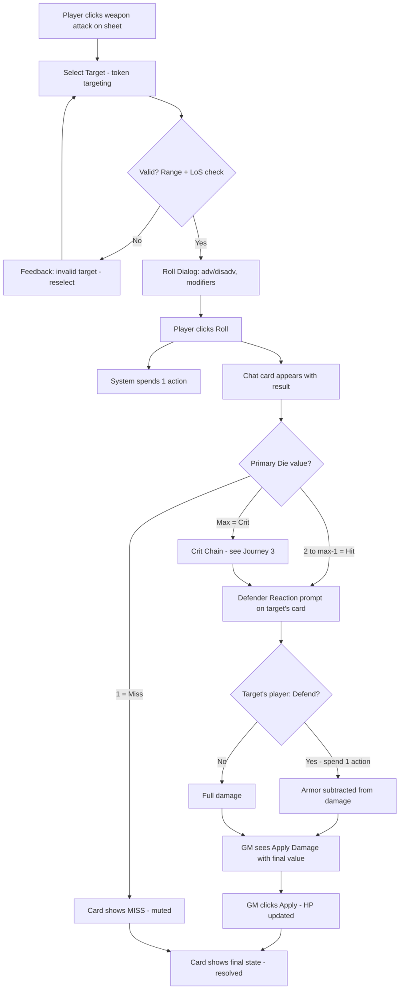
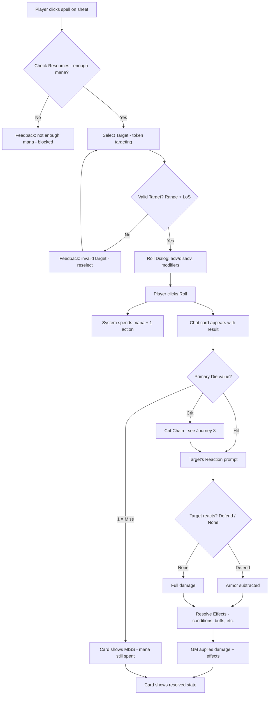
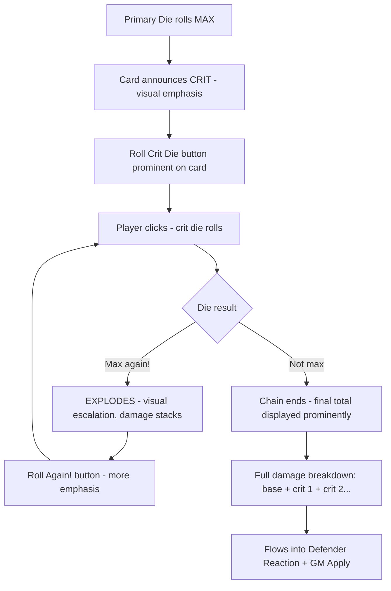
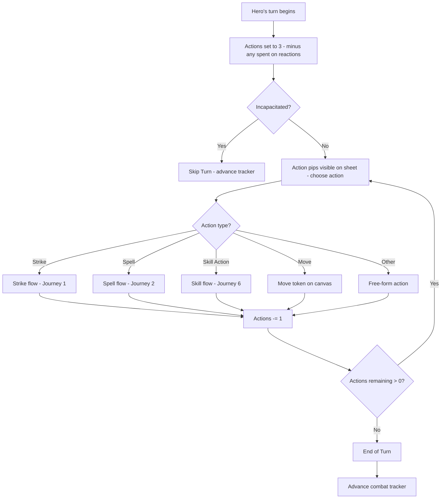
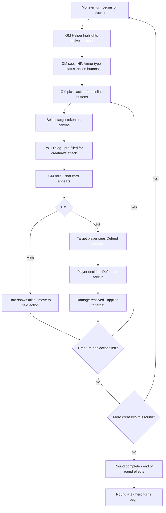
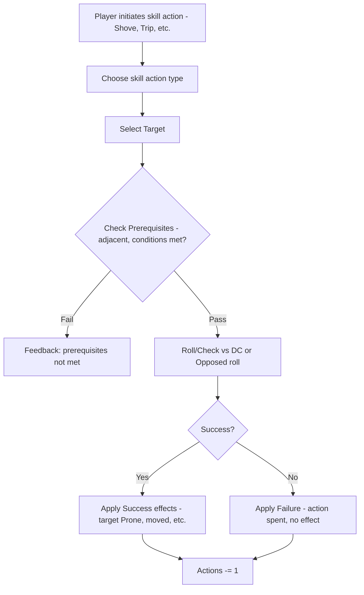
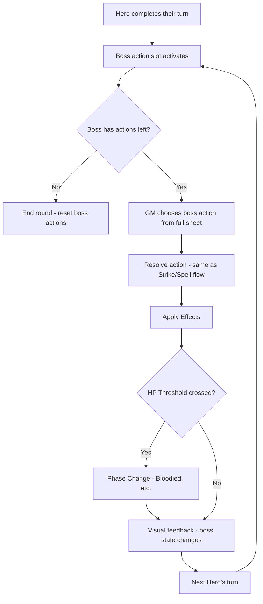
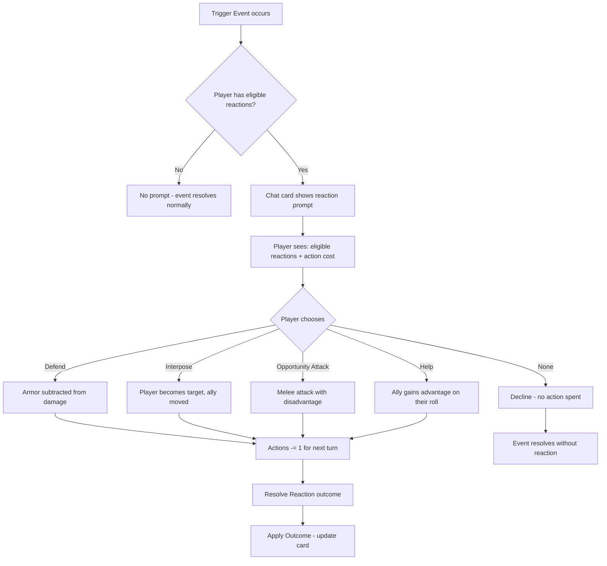

::: warning AI-Generated Content
This document was primarily generated with AI assistance. Since this is a community-driven project with contributors having limited time, AI helps accelerate documentation and planning work.
:::

::: info Planning in Progress
All planning documents are not final and are actively under construction. Details may change significantly as the project evolves.
:::

# UX Design Specification - Nimble System

**Author:** developer
**Date:** 2026-03-04

::: warning
These are conceptual mockups, not final designs. Colors, exact styling, component appearance, and pixel-level details are illustrative only. The purpose is to explore direction, structure, and interaction patterns - not to define the final look and feel.
:::

---

<!-- UX design content will be appended sequentially through collaborative workflow steps -->

## Executive Summary

### Project Vision

The Nimble FoundryVTT system delivers the official digital play experience for Nimble TTRPG - a fast, tactical, 5e-compatible RPG. The UX philosophy is "table-feel": automation handles bookkeeping (mana costs, action tracking, effect application, dice math) so players and GMs focus on the game. Players remain in control of meaningful actions - particularly dice rolls - with optional settings to increase automation for groups that prefer it.

The system serves two distinct interaction modes: players interacting through their character sheet and chat cards, and GMs managing encounters through a combination of the combat tracker carousel, GM Helper utility, and chat card tools.

### Target Users

**Players** - Intermediate-to-advanced TTRPG players running weekly sessions on FoundryVTT. They expect a responsive character sheet, clear rolling experience, and automatic bookkeeping without losing the thrill of manual rolls (crits, exploding dice). They should never fight the interface to do what they want.

**GMs** - Experienced game masters running encounters ranging from 12+ creature hordes to single solo bosses. They need two distinct combat workflows: fast batch management for hordes (GM Helper) and deliberate tactical planning for bosses (full sheet). They should be able to run large combats without friction.

**Module Developers** - Third-party FoundryVTT module authors who need stable hooks and predictable data contracts to build integrations (e.g., animation modules triggered by spell casts).

### Key Design Challenges

1. **Dual-role chat cards** - Chat messages must present different interactive actions based on viewer role (player vs GM). This is the primary UX design challenge for Phase 1.
2. **GM Helper information density** - Showing enough creature data (HP, actions, status, synergies) for 12+ creatures without overwhelming the GM. Glance-decide-act, not read.
3. **Excitement preservation** - Crit chains and exploding dice are emotional peaks. The UX must make these moments feel thrilling through manual interaction and visual feedback, while quietly automating everything else.
4. **Dual combat workflows** - Horde combat (batch, fast) and solo boss (deliberate, full-sheet) are fundamentally different experiences for the same user, often in the same session.

### Design Opportunities

1. **Chat cards as interaction hub** - Well-designed role-based chat cards could make Nimble's combat flow feel more connected than competing VTT systems, becoming the shared space where player actions meet GM responses.
2. **Minion batch management** - Clean split/combine/batch-resolve patterns for minion groups could be a standout differentiator.
3. **Progressive disclosure** - Nimble is already simpler than 5e. The UI can lean into that - show less by default, expand on demand - making the VTT feel as fast as the game itself.

## Core User Experience

### Defining Experience

The core experience loop of the Nimble FoundryVTT system is the **attack/spell activation flow**. This is the most frequent player action and the interaction that defines the system's value:

1. **Player initiates** - Clicks an attack or spell from their character sheet
2. **Roll dialog** - Player sets options (advantage/disadvantage, modifiers) and rolls
3. **Chat card appears** - Shows the outcome with clear result communication
4. **Downstream interactions** - Extra rolls (crit dice, exploding dice), saving throws for targets, and GM actions (apply damage, manage effects) flow naturally from the card

Everything else in the system - character sheets, combat tracker, GM Helper, compendium - exists to support or feed into this core loop. Outside of combat, player interaction is light: moving tokens, occasionally using a feature. The system's UX investment concentrates on combat because that's where 80%+ of meaningful interaction happens.

### Platform Strategy

- **Platform:** FoundryVTT v13, desktop browser only
- **Input:** Mouse and keyboard primary. No touch optimization required.
- **Offline:** Not applicable - FoundryVTT requires a hosted server connection
- **Constraints:** All UI must work within FoundryVTT's application framework (ApplicationV2, sidebar, chat log, canvas). The system controls its own sheets, dialogs, chat cards, and tracker UI, but cannot modify Foundry's chrome.

### Effortless Interactions

These interactions should require zero thought from the user:

- **Bookkeeping** - Mana deduction, action tracking, and effect application happen automatically when a player uses an ability. The player never manually adjusts these during play.
- **Initiative and turn order** - Side-based initiative sorts correctly, solo boss slots insert after each hero automatically. The GM starts combat and the carousel just works.
- **GM damage application** - When a player's attack hits, the GM clicks "Apply Damage" on the chat card. One click, done. No mental math, no opening the target's sheet.
- **Resource tracking** - HP, mana, actions remaining, and active effects are always visible and current on the character sheet without manual updates.

### Critical Success Moments

1. **The crit chain** - A player rolls a natural max on their primary die. The chat card prompts "Roll crit die." They click - it explodes. They click again - it explodes *again*. The damage stacks visually, the table erupts. This moment must feel thrilling, not procedural. If the crit chain feels flat, the system fails emotionally.

2. **GM horde round** - The GM runs 12 creature turns in a single combat round using the GM Helper. No individual sheets opened, no forgetting which goblin already went. If this feels slow or disorienting, the GM Helper fails its purpose.

3. **First attack of a session** - A player (possibly new) clicks an attack from their sheet for the first time. The activation dialog is immediately understandable, they roll, the chat card shows a clear result. If this moment confuses them, onboarding fails.

### Experience Principles

1. **Activation-first** - The attack/spell activation is the entry point to everything. Make initiating an action fast, clear, and satisfying. Everything downstream flows from this moment.
2. **Automate the boring, preserve the exciting** - Mana math and action tracking are invisible. Crit chains and exploding dice are manual, visual, and thrilling. The system knows which is which.
3. **Glance, decide, act** - Every UI surface (character sheet, GM Helper, chat card, combat carousel) should support a three-beat rhythm: glance at the relevant info, make a decision, execute with one click.
4. **Role-aware simplicity** - Show each user only what they need. Players see their actions and prompts. GMs see management tools. Neither sees the other's clutter.

## Desired Emotional Response

### Primary Emotional Goals

1. **Confidence** - Users always know what to click and what will happen next. No hesitation, no guessing. The activation dialog, chat card actions, and sheet layout communicate their purpose immediately.

2. **Excitement** - Crit chains, exploding dice, and big damage numbers are emotional peaks. The system amplifies these moments through manual interaction and visual feedback, making them stories players retell.

3. **Flow** - For GMs running horde combat, the experience should feel like a rhythm - creature after creature resolved smoothly through the GM Helper without breaking stride. For players, the attack-roll-result loop should feel seamless and natural.

4. **Trust** - "The system got it right." Mana was deducted correctly. The effect was applied. The initiative order is correct. Users stop auditing the software and focus entirely on the game.

### Emotional Journey Mapping

| Stage | Player Emotion | GM Emotion |
|---|---|---|
| **Opening the sheet** | Oriented - everything is where I expect it | Prepared - my creatures and tools are ready |
| **Initiating an attack/spell** | Confident - the dialog makes sense, I know my options | Efficient - I can act quickly from the tracker |
| **Rolling dice** | Anticipation - will it hit? Will it crit? | Engaged - watching the outcome unfold |
| **Crit / exploding dice** | Excitement - I get to keep rolling, the stakes escalate | Entertained - the table energy is high |
| **Seeing the result** | Satisfaction - clear outcome, damage shown, effects applied | In control - one click to apply, move to next creature |
| **Something goes wrong** | Recoverable - I can fix this without disrupting the flow | Unworried - mistakes are easy to undo |
| **Returning next session** | Familiar - I remember how everything works | Confident - I can run another big encounter |

### Micro-Emotions

**Critical to preserve:**
- **Confidence over confusion** - Every UI element must communicate its purpose. If a player hesitates before clicking, the design has failed at that point.
- **Excitement over anxiety** - High-stakes moments (crits, saves) should feel thrilling, not stressful. The UI should celebrate good outcomes and make bad outcomes feel fair, not punishing.
- **Trust over skepticism** - Automated bookkeeping only works if users believe it's correct. Clear feedback ("2 mana spent", "1 action used") builds trust incrementally.

**Critical to avoid:**
- **Overwhelm** - Too much information on screen. The GM Helper showing every stat for 12 creatures would create cognitive overload, not efficiency.
- **Disconnection** - If automation makes combat feel like watching a calculator, the table-feel is lost. Manual dice moments are the antidote.
- **Frustration** - Misclicks, unclear results, or having to undo complex action chains. Recovery must be fast and obvious.

### Design Implications

| Emotional Goal | UX Design Approach |
|---|---|
| Confidence | Clear labels, predictable layouts, consistent interaction patterns across all surfaces. No ambiguous icons without labels. |
| Excitement | Visual escalation for crit chains (stacking dice, growing numbers). Manual click-to-roll for exploding dice - the player drives the moment. |
| Flow | GM Helper optimized for sequential creature resolution. Minimal clicks per creature turn. No modal interruptions during horde combat. |
| Trust | Visible feedback for every automated action ("Mana: 5 → 3", "Action used"). No silent state changes. |
| Recovery | Undo/edit capabilities on chat cards where feasible. Clear error states with obvious next steps. |

### Emotional Design Principles

1. **Celebrate peaks, silence valleys** - Crits and exploding dice get visual fanfare. Mana deduction and action tracking happen quietly in the background. The system knows what deserves attention.
2. **Feedback builds trust** - Every automated change shows what happened. Brief, clear, non-intrusive. Users should never wonder "did the system do that correctly?"
3. **Never block the rhythm** - No modal dialogs during GM horde turns. No forced confirmations for routine actions. The UI should never make the table wait.
4. **Mistakes are cheap** - Where possible, make actions reversible or editable. The emotional cost of a misclick should be seconds, not minutes.

## UX Pattern Analysis & Inspiration

### Inspiring Products Analysis

**dnd5e (FoundryVTT)**
- Clean character sheet layout with good tab organization and recognizable aesthetic
- Weakness: Chat cards are dense and automation is opaque - things happen without clear communication of why
- Takeaway: Sheet organization is a reasonable baseline; chat card design needs significant improvement

**PF2e (FoundryVTT)**
- Most feature-complete system on Foundry with incredible automation depth
- Weakness: Overwhelming complexity - dozens of sheet tabs, chat cards are walls of text, steep learning curve
- Takeaway: A cautionary tale for "automate everything." Depth without simplicity creates a power-user tool, not a game experience

**a5e / Level Up (FoundryVTT)**
- Similar to dnd5e with additional toggles and configuration options
- Weakness: Shares the clutter problem - more options doesn't mean better UX
- Takeaway: Feature additions must be weighed against interface clarity

**Baldur's Gate 3 (CRPG)**
- Clear action economy display - you always know what you can do on your turn
- Visual ability bar with obvious, clickable actions
- Turn-based combat UI that feels tactical without being overwhelming
- Takeaway: The feeling of tactical clarity - seeing your options, acting decisively - is what VTT combat should aspire to

### Transferable UX Patterns

**From dnd5e:**
- Tab-based sheet organization as a baseline structure
- Familiar layout conventions that TTRPG players expect (stats at top, abilities grouped logically)

**From BG3:**
- Action economy visibility - always clear what actions remain on your turn
- Ability bar concept - key actions surfaced prominently, not buried in lists
- Visual clarity in tactical situations - relevant information foregrounded, everything else suppressed

**From PF2e (inverted - learn from their weaknesses):**
- Progressive disclosure instead of showing everything at once
- Chat cards that communicate outcomes, not data dumps
- Automation that explains itself briefly rather than operating silently

### Anti-Patterns to Avoid

1. **The PF2e trap: feature completeness over usability** - Adding every possible automation and option creates power-user tools, not game experiences. Every feature added must pass the "does this serve the table-feel?" test.
2. **Opaque automation (dnd5e)** - When the system does something automatically, users must see brief feedback. Silent state changes erode trust.
3. **Wall-of-text chat cards** - Chat cards that display every modifier, every rule reference, and every calculation. Players need outcomes, not audit trails.
4. **Tab explosion** - Sheets with 8+ tabs where users can't remember where things live. Fewer tabs with progressive disclosure beats many tabs with flat content.
5. **Configuration overload** - Settings menus with dozens of toggles for edge-case behaviors. Sensible defaults that work for 90% of tables, with minimal configuration for the rest.

### Design Inspiration Strategy

**What to Adopt:**
- Tab-based sheet organization (proven, expected by TTRPG players)
- Action economy visibility inspired by BG3 (always show what you can do this turn)
- Brief, outcome-focused chat cards (hit/miss/crit + damage + effects, not a calculation log)

**What to Adapt:**
- BG3's ability bar concept → attacks and spells surfaced prominently on the character sheet, not buried in inventory-style lists
- dnd5e's sheet aesthetic → match Nimble's own rulebook aesthetic instead of mimicking D&D's look

**What to Avoid:**
- PF2e's complexity-first approach - conflicts with "simple interface" principle
- Dense chat cards - conflicts with "glance, decide, act" principle
- Silent automation - conflicts with trust emotional goal
- Feature-flag-driven UX - conflicts with "sensible defaults" philosophy

**Competitive Positioning:**
Every major VTT system over-serves power users at the expense of clarity. Nimble's opportunity is to do less, better - a system that feels as fast and clean as the game it represents. The simplicity of Nimble's rules should be matched by the simplicity of its interface.

## Design System Foundation

### Design System Choice

**Custom Design System** - built on the existing SCSS + Svelte component foundation within FoundryVTT's application framework.

This is not a choice between options - the platform constraints (FoundryVTT ApplicationV2, Svelte 5 rendering, no external component libraries) dictate a custom approach. The design system is already partially established in the codebase and needs formalization and extension, not replacement.

### Rationale for Selection

- **Platform lock-in:** FoundryVTT provides its own application framework, CSS baseline, and rendering pipeline. External component libraries (MUI, Chakra, etc.) are incompatible.
- **Existing foundation:** The project has established SCSS patterns (`--nimble-*` CSS custom properties), light/dark mode support (`[data-theme="dark"]`), scoped Svelte component styles, and global styles in `src/scss/`.
- **Brand requirement:** The PRD specifies the UI should match the Nimble rulebook aesthetic. This requires custom visual design, not a themed generic system.
- **Team context:** A designer is joining in the coming weeks. The design system should provide a solid technical scaffold that the designer can skin with final visual decisions (colors, typography, spacing, iconography).

### Implementation Approach

**Current State (Technical Scaffold):**
- CSS custom properties (`--nimble-*`) for theming - colors, spacing, typography
- Light/dark mode via `[data-theme="dark"]` attribute
- Scoped styles in Svelte components, global styles in `src/scss/`
- SCSS with auto-prepended `_functions.scss` utilities

**Designer Handoff Points:**
When the designer is ready, these are the areas where visual design decisions will land:
- Color palette → `--nimble-*` color tokens
- Typography scale → `--nimble-*` font tokens
- Spacing system → `--nimble-*` spacing tokens
- Component visual style → individual Svelte component styles
- Nimble rulebook aesthetic alignment → global theme styles

**Development Approach:**
- Build components with semantic CSS custom properties (e.g., `--nimble-card-bg`, `--nimble-action-color`) so the designer can reskin without restructuring
- Use consistent naming conventions for design tokens
- Keep component structure and visual style separable - layout and interaction in code, visual polish as token-driven

### Customization Strategy

**Design Token Categories:**
- **Color:** Primary, secondary, accent, surface, text, status (success/warning/error), role-specific (player action, GM action)
- **Typography:** Font families, size scale, weight scale, line heights
- **Spacing:** Consistent spacing scale for padding, margins, gaps
- **Borders:** Radius scale, border widths, divider styles
- **Elevation:** Shadow scale for layered UI (dialogs over sheets, tooltips over cards)
- **Animation:** Duration and easing tokens for transitions (chat card reveals, dice roll feedback, crit escalation)

**Component Inventory (to formalize):**
- Buttons (primary action, secondary, destructive, icon-only)
- Form inputs (text, number, select, checkbox/toggle)
- Cards (chat cards, item cards, creature cards in GM Helper)
- Tabs (sheet navigation)
- Badges/tags (conditions, status indicators)
- Tooltips/popovers (synergy reminders, stat details)
- Dialogs (activation, creation, level-up)

## Defining Experience

### The Core Interaction

**"Click, roll, resolve - all from one place."**

The defining experience of Nimble on FoundryVTT is the attack/spell activation flow. A player clicks an ability, sets their options, rolls, and the chat card becomes the single workspace for resolving every consequence - damage application, crit chains, saving throws, target changes, and re-rolls. No second card is ever generated. No going back to the sheet.

This interaction is what players will describe to friends: "I click my attack, roll, and everything just flows from there. When I crit, I keep rolling right on the card. The GM applies damage right there too."

### User Mental Model

**What players expect (from dnd5e/PF2e/Roll20):**
- Click ability on sheet → dialog → roll → result in chat
- Familiar flow, but they're used to clutter, confusion, and needing to re-do actions when something goes wrong

**Where Nimble diverges:**
- Nimble's dice system is unique - primary die, exploding dice, vicious attacks, crit chains. The roll dialog and chat card must teach these mechanics through clear labeling and interaction, not documentation.
- The chat card is interactive and persistent - not just a result display. Players and GMs coming from other systems will expect a static card. The interactivity (re-roll, apply to new targets, adjust damage) is a learnable upgrade.

**Mental model shift we're asking for:**
- From: "The chat card shows what happened"
- To: "The chat card is where I finish resolving what happened"

This shift is small but significant. The card goes from passive readout to active workspace.

### Success Criteria

1. **"This just works"** - A player clicks an attack, the dialog appears immediately, options are clear, they roll, the card shows the outcome. No confusion at any step.
2. **"I never have to redo it"** - If a roll needs to be re-done (wrong modifier, GM ruling), the player re-rolls from the card with the same parameters. They never navigate back to the sheet to start over.
3. **"One card, full resolution"** - A single chat card handles: initial roll result, crit chain (multiple sequential rolls), saving throw prompts for targets, damage application to one or multiple targets, and damage adjustment by the GM. No secondary cards generated.
4. **"The GM just clicks Apply"** - When an attack hits, the GM applies damage with one click to the targeted token. If they need a different target, they switch on the card. If they need to adjust the number, they can. All without leaving the card.
5. **Speed** - The full flow from "click attack" to "damage applied" takes under 10 seconds for a routine hit, under 20 seconds for a crit chain with exploding dice.

### Novel UX Patterns

**Established patterns (familiar, no learning curve):**
- Click ability → roll dialog → chat result (standard VTT flow)
- Tab-based sheet navigation
- Combat tracker with turn order

**Novel patterns (require clear affordances):**
- **Persistent interactive chat card** - Cards remain actionable after creation. Re-roll buttons, target selectors, and damage adjustment live on the card. This is uncommon in VTT systems where cards are static.
- **Crit chain interaction** - Sequential manual rolls on the same card when dice explode. Each explosion prompts another click. The card grows as the chain continues.
- **Multi-target damage from single card** - GM can apply damage to the original target, switch to a new target, and apply again - all from one card. Useful for AoE spells and GM corrections.
- **GM damage adjustment** - "Apply Damage" uses the rolled value by default, but the GM can adjust before applying. Handles resistances, GM rulings, and edge cases without a separate dialog.

**Teaching strategy for novel patterns:**
- Clear button labels (not icons alone) - "Re-roll Attack", "Apply Damage", "Roll Crit Die"
- Visual state changes - the card visually updates when damage is applied or a target is changed
- Progressive discovery - basic flow (roll → apply) works without knowing about re-roll or target switching. Advanced features are visible but not required.

### Experience Mechanics

**1. Initiation:**
- Player clicks an attack or spell on their character sheet
- The activation dialog appears immediately - no intermediate target selection step
- Target selection is optional (configurable setting to require targets in combat)

**2. Roll Dialog:**
- Shows relevant options: advantage/disadvantage, situational modifiers, primary die modifier
- Player confirms and rolls
- System automatically deducts mana and actions

**3. Chat Card - Initial Result:**
- Card appears showing: all dice rolled with Primary Die highlighted, hit/miss/crit status (based on Primary Die value - 1 = miss, max = crit), total damage, effects triggered
- Automated bookkeeping feedback shown briefly ("2 mana spent", "Action used")
- Role-based actions displayed: players see "Roll Crit Die" / "Roll Save"; GMs see "Apply Damage" / "Manage Effects"

**4. Chat Card - Crit Chain (if applicable):**
- On natural max of primary die: card prompts "Roll Crit Die"
- Player clicks → crit die rolls → if max again, prompts "Roll again!" (exploding)
- Each roll appends to the card visually - damage stacks, excitement builds
- Chain ends when a roll doesn't max - final total displayed prominently

**5. Chat Card - GM Resolution:**
- GM sees "Apply Damage" with the rolled total pre-filled
- GM can adjust the damage value before applying
- GM can switch target (new target added to the card, original remains selectable)
- One click applies damage to the selected target's token
- If saving throws are needed, target players see prompts on the card

**6. Chat Card - Re-roll (if needed):**
- "Re-roll" button available on the card, using the exact same parameters
- No need to return to the sheet or re-open the activation dialog
- Re-roll replaces the previous result on the card (or appends, depending on GM preference)

**7. Completion:**
- Damage applied, effects resolved, card remains as a record
- Combat tracker advances to next turn
- Card is still interactive for late corrections (GM can re-apply, adjust, or add targets)

## Visual Design Foundation

### Color System

**Status:** Awaiting designer guidelines. The following documents the system's semantic color needs - the designer will define the actual palette.

**Semantic Color Roles Required:**
- **Primary / Secondary / Accent** - Brand colors from Nimble rulebook aesthetic (designer-defined)
- **Surface colors** - Card backgrounds, sheet backgrounds, dialog backgrounds (must support light and dark mode)
- **Text colors** - Primary, secondary, muted, inverse (must meet WCAG AA contrast on all surfaces)
- **Status colors** - Success (healing, buffs), Warning (conditions, low resources), Error (damage, failed saves), Info (neutral notifications)
- **Role-specific colors** - Player action affordances vs GM action affordances. These should be subtly distinct so users instinctively know "this button is for me" without reading labels.
- **Combat state colors** - Active turn highlight, current combatant, conditions on tokens
- **Dice result colors** - Hit (Primary Die highlighted, not a 1), crit (Primary Die maxed, visually distinct celebration), miss (Primary Die rolled 1, muted/neutral)

**Technical Requirements:**
- All colors implemented as `--nimble-*` CSS custom properties
- Light/dark mode via `[data-theme="dark"]` - every semantic color needs both variants
- Sufficient contrast ratios (WCAG AA minimum) for all text-on-surface combinations
- Designer delivers color values; development maps them to existing token architecture

### Typography System

**Status:** Awaiting designer guidelines for font selection and Nimble rulebook aesthetic alignment.

**Structural Requirements:**
- **Headings** - Sheet section headers, dialog titles, card headers. Must be scannable at a glance.
- **Body text** - Feature descriptions, spell text, ability details. Moderate-length blocks (2-5 sentences typical). Must be comfortable to read in constrained sheet widths.
- **Data values** - HP, mana, stats, dice results. Numeric-heavy, needs to be instantly readable. Likely benefits from tabular/monospace or a distinct weight.
- **Labels** - Field labels, button text, tab names. Short, concise, must be legible at small sizes.
- **Chat card text** - Roll results, damage numbers, action labels. Must be scannable in a vertically-scrolling chat log alongside other players' cards.

**Type Scale Approach:**
- Limited scale (4-5 sizes) to maintain simplicity - avoid the PF2e trap of too many visual levels
- Clear hierarchy: section header > subsection > body > label > caption
- Numbers and dice results may warrant distinct treatment (size, weight, or font) for instant recognition

**Designer Handoff:**
- Font family selection (primary + optional secondary)
- Specific size scale values
- Weight usage guidelines
- Nimble rulebook aesthetic alignment

### Spacing & Layout Foundation

**Status:** Structural approach defined below. Final spacing values subject to designer input.

**Layout Philosophy:**
- **Compact but clean** - FoundryVTT windows are constrained; space is valuable. Favor efficient layouts with clear visual separation over generous whitespace. Avoid the "airy webapp" feel that wastes space in a VTT context.
- **Progressive disclosure** - Primary information visible by default; secondary information expandable. This preserves density where it matters while keeping the interface uncluttered.
- **Consistent rhythm** - Use a base spacing unit (likely 4px or 8px) with consistent multipliers. Spacing between elements should feel predictable and harmonious.

**Layout Principles:**
1. **Sheet layout** - Tab-based navigation with compact content areas. Stats and key values always visible. Features, spells, and inventory in scrollable lists.
2. **Chat cards** - Vertical stack within Foundry's chat log. Cards must be narrow-friendly (chat sidebar width). Action buttons prominent but not oversized.
3. **GM Helper** - Dense by design - showing 12+ creatures means each creature row must be minimal. Expandable rows for details, collapsed by default.
4. **Dialogs** - Focused and minimal. Activation dialog shows only relevant options. No scrolling required for the common case.
5. **Combat carousel** - Horizontal strip, compact tokens/portraits, clear active-turn indicator.

**Grid & Alignment:**
- No formal grid system - FoundryVTT's application windows are variably sized. Use flexbox/CSS grid for responsive internal layouts.
- Consistent alignment: left-align labels, right-align numeric values (standard for data-heavy interfaces)

### Accessibility Considerations

- **Color contrast:** WCAG AA minimum (4.5:1 for normal text, 3:1 for large text) across both light and dark themes
- **Color independence:** Status information (hit/miss/crit, conditions, health) must not rely on color alone - use icons, labels, or visual weight as redundant signals
- **Font sizing:** Respect user's browser font size settings where feasible within FoundryVTT constraints
- **Focus indicators:** Interactive elements (buttons, inputs, tabs) should have visible focus states for keyboard navigation
- **Motion sensitivity:** Crit chain animations and dice roll effects should respect `prefers-reduced-motion` media query - provide static alternatives

## Design Direction Decision

### Design Directions Explored

Six structural layout explorations were generated as an interactive HTML mockup (`ux-design-directions.html`), covering the primary UI surfaces:

1. **Chat Cards** - Single-card resolution workspace. Explored compact vertical layout with Primary Die highlighted, role-based action buttons (player vs GM), crit chain expansion area, and re-roll/target-switch controls.
2. **Crit Chain** - Sequential dice explosion interaction. Explored stacking visual pattern where each exploding die appends to the card with escalating visual energy.
3. **Character Sheet** - Tab-based layout with stats bar, action-ready spell/attack lists. Explored compact stat display (4 stats: STR/DEX/INT/WIL), HP/mana/armor visibility, and tab organization.
4. **GM Helper** - Dense creature list for horde combat. Explored compact rows with inline HP, armor type (None/M/H), action buttons, and expandable detail panels. Minion grouping with split/combine controls.
5. **Combat Carousel** - Horizontal turn-order strip. Explored compact token portraits with active-turn highlighting and side-based initiative grouping.
6. **Roll Dialog** - Activation dialog with advantage/disadvantage toggles, modifier inputs, and clear roll button.

All mockups were audited against Nimble rules and corrected for accuracy - no attack rolls (damage dice ARE the attack), Primary Die determines hit/miss/crit, monster armor as type categories (None/M/H) not numeric values, 3 unified actions with reactions costing actions, Monster Level not CR, speed in squares (default 6).

### Chosen Direction

**Approach: Functional-first scaffold, designer-skinned later.**

The design direction prioritizes structural correctness and interaction design over visual polish. The HTML mockups establish layout patterns, information hierarchy, and interaction flows that are rules-accurate and aligned with the "glance, decide, act" principle. Final visual treatment (colors, typography, iconography, Nimble rulebook aesthetic) will be applied when the designer delivers their guidelines.

**Key structural decisions locked in:**
- Chat card as persistent interactive workspace (not static result display)
- Single-card resolution - no secondary cards generated from attacks
- GM Helper as dense, expandable creature list (not full-sheet per creature)
- Target selection before roll (validated for range + LoS), with configurable setting to require targets in combat
- Re-roll from card with same parameters (never navigate back to sheet)

### Stakeholder Feedback Integration

**1.0.0 Scope Refinement:**
- Scope defined as "anything necessary to play a game using the system"
- Aligns with PRD Phase 1: "deliver a polished, complete play experience for the Nimble rules that exist today"
- GM Helper v1 must be usable for horde combat but not feature-complete - minimum viable version ships in 1.0.0

**GM Helper Reframe (formerly "GM Tracker" / "NCS"):**
- Renamed from "GM Tracker" and "Nimble Combat System" to **GM Helper**
- Conceptual shift: not just a combat tracker, but a context-aware GM companion tool
- Available with or without active combat - shows world NPCs/monsters outside combat, filters to combatants during combat
- Architecture already supports this (documented in architecture.md)

**Designer Wireframe Feedback (Trevor):**
- Awaiting designer's visual guidelines - structural layout proceeds independently
- Designer will provide color palette, typography, iconography, and Nimble rulebook aesthetic alignment
- Current design token architecture (`--nimble-*` CSS custom properties) is ready for designer values

### Design Rationale

1. **Rules accuracy over convention** - Every VTT system defaults to D&D patterns (attack rolls, AC, CR). Nimble's unique mechanics (Primary Die, armor types, unified actions) require purpose-built UI, not reskinned 5e patterns. The mockup audit caught and corrected 7+ D&D-isms.

2. **Structure before skin** - With a designer joining in weeks, investing in pixel-perfect visuals now would be wasted effort. Locking in correct layouts, information hierarchy, and interaction patterns provides maximum value. The designer skins the scaffold.

3. **Chat card as workspace** - The PRD and stakeholder feedback converge on the chat card being the resolution workspace, not a passive readout. This is the biggest UX differentiator vs competing VTT systems and the area requiring the most novel interaction design.

4. **GM Helper flexibility** - The GM Helper concept (context-aware, not just combat) serves more use cases than a pure combat tracker. The architecture supports it, and the Phase 1 scope keeps the initial version focused on horde combat while the design allows expansion.

### Implementation Approach

**Phase 1 Build Order (UX-informed):**

1. **Chat cards first** - Biggest design risk, most novel interactions, most stakeholder feedback. Build the single-card resolution pattern with role-based actions, crit chain, and re-roll.
2. **Roll dialog** - Entry point to the core loop. Must be immediately clear and fast.
3. **GM Helper v1** - Dense creature list with inline actions. Start minimal (HP, armor type, actions), expand based on playtesting.
4. **Character sheet polish** - Existing sheet works; polish for action visibility and stat clarity.
5. **Combat carousel refinement** - Existing carousel works; refine active-turn highlighting and solo boss slot display.

**Designer Integration Points:**
- Color tokens → `--nimble-*` CSS custom properties (ready for values)
- Typography → font family and scale tokens (scaffold uses system fonts)
- Component visual style → scoped Svelte component styles (structure in place)
- Nimble aesthetic → global theme styles (placeholder until designer delivers)

## User Journey Flows

_Flows aligned with the official Nimble combat flowchart (8-panel reference diagram covering Overall Combat Loop, Hero Turn, Attack & Defense, Legendary/Boss, Strike, Spell, Skill Action, and Reaction)._

### Journey 1: Player Attack - Strike (Weapon Attack)

_Aligned with combat flowchart panel 5 (Strike) + panel 3 (Attack & Defense)._

**Key UX decisions:**
- Target selection happens **before** the roll dialog - validated for range and line of sight
- Defend prompt goes to the **target player**, not the GM
- Action deduction happens at roll time (1 action per attack)
- On miss (Primary Die = 1), no Defend prompt needed - action still spent
- Re-roll available on card with same parameters if needed

### Journey 2: Player Attack - Spell (Single Target)

_Aligned with combat flowchart panel 6 (Spell)._

**Key difference from Strike:**
- Resource check (mana) happens **before** target selection - no wasted targeting if you can't cast
- Mana spent even on a miss (resource committed at roll time)
- Effects resolution step after damage (spells often apply conditions)

### Journey 3: Crit Chain (Emotional Peak)

**Key UX decisions:**
- Each explosion should feel **escalating** - visual energy grows with each successive crit
- Damage stacks visibly on the card (players see the number growing)
- Button label changes: "Roll Crit Die" → "Roll Again!" - keeps the energy up
- Final total gets prominent display - this is the number they'll brag about
- All on one card - the card becomes a story artifact in the chat log

### Journey 4: Hero Turn (3-Action Loop)

_Aligned with combat flowchart panel 2 (Hero Turn)._

**Key UX decisions:**
- Action pips (3 indicators) always visible on sheet - decrement as actions are used
- Reactions spent between turns pre-subtracted at turn start ("You have 2 actions - 1 spent on Defend")
- No forced action order - player chooses freely each action
- Turn can be ended early (skip remaining actions)

### Journey 5: GM Horde Round (via GM Helper)

_Aligned with combat flowchart panels 1 (Overall Combat Loop) + 2 (Hero Turn, monster equivalent)._

**Key UX decisions:**
- Flunkies: system enforces no-crit rule (Primary Die max treated as normal hit)
- Minion groups: resolved as batch - single roll for the group, single damage application
- Creature actions tracked per-creature in GM Helper (action pips per row)
- Monster armor is passive (None/M/H) - GM never makes Defend decisions for monsters
- Whether GM Helper auto-advances to next creature: **TBD** - to be decided during implementation/playtesting

### Journey 6: Skill Action

_Aligned with combat flowchart panel 7 (Skill Action)._

### Journey 7: Legendary/Boss Encounter

_Aligned with combat flowchart panel 4 (Legendary/Boss)._

**Key UX decisions:**
- Boss uses **full sheet**, not GM Helper - deliberate tactical play
- Boss slot appears in combat carousel **after each hero turn**
- Phase changes (Bloodied, etc.) trigger visible state change on token + sheet
- GM decides boss actions thoughtfully - no speed pressure like horde flow

### Journey 8: Reaction (Generic - Off-Turn)

_Aligned with combat flowchart panel 8 (Reaction)._

**Key UX decisions:**
- Reaction prompts appear **on the chat card** - no separate dialog
- Multiple eligible reactions shown if applicable (e.g., Interpose + Defend combo costs 2 actions)
- Action cost clearly stated: "Defend (1 action - you'll have X actions next turn)"
- Class-specific reactions (Phase 2) plug into this same generic flow
- 1/round limit enforced by system - already-used reactions greyed out

### Journey Patterns

1. **Card-as-workspace** - Every journey resolves through the chat card. The card is never just a display - it's where decisions happen and actions complete.

2. **Validate-before-commit** - Resources checked before targeting (spells). Targets validated before rolling (strikes). No wasted actions on invalid attempts.

3. **Roll-then-react** - Nimble's core pattern: roll first, then decide how to respond. Attacks roll damage, then Defend decision. Crits roll, then chain. The UI supports this sequence naturally.

4. **Informed decisions** - Before any click, show what will happen. Defend shows damage reduction math. Apply Damage shows the target. Crit shows running total. No blind clicks.

5. **Progressive card state** - Cards evolve: initial result → defender reaction → GM resolution → final record. Each state adds information without removing previous context.

6. **Role-gated actions** - Players see their prompts (Defend, Roll Crit, Roll Save). GMs see their tools (Apply Damage, Adjust, Switch Target). Neither sees the other's clutter.

7. **Action economy is always visible** - Action pips on sheet, reaction costs on prompts, pre-subtracted totals at turn start. The player always knows their budget.

### Flow Optimization Principles

1. **Zero-navigation resolution** - Once the roll happens, everything resolves on the card. No going back to sheets, no opening dialogs, no switching windows.

2. **Minimal clicks per action** - GM horde creature: 3 clicks (pick action → target → roll). Player strike: 3 clicks (click ability → target → roll). Defend: 1 click.

3. **Fail-forward design** - Invalid targets get clear feedback and retry. Misclicks correctable from card (re-roll, adjust, switch target). Error cost is seconds, not minutes.

4. **Silence the routine, celebrate the peaks** - Mana deduction: quiet feedback. Action decrement: pip update. Crit chain: visual escalation. Phase change: dramatic state shift.

5. **Consistent trigger → prompt → resolve** - Every reaction, every roll, every application follows the same rhythm. Learn it once, recognize it everywhere.

## Component Strategy

### Existing Design System Components

**Foundation (already built and proven):**

| Category | Components | Status |
|---|---|---|
| **Sheet Framework** | `SvelteApplicationMixin(ApplicationV2)`, tab navigation (`PrimaryNavigation`, `SecondaryNavigation`), form inputs | Stable |
| **Chat Cards** | `CardHeader`, `DamageNode`, `DamageRoll`, `RollSummary`, `Targets`, `ItemCardEffects`, `SavingThrowNode`, `ConditionNode`, `TextNode` | Stable - extend with new nodes |
| **Character Sheet** | `HitPointBar`, `ManaBar`, `HitDiceBar`, `ArmorClass`, stat pages, conditions tab | Stable - polish needed |
| **NPC Sheet** | `NPCSheet`, `NPCCoreTab`, `NPCConditionsTab`, `NPCNotesTab` | Stable |
| **Combat Tracker** | `CombatTracker`, `BaseCombatant`, `MonsterCombatant`, `CollapsedMonsterCard`, controls | Stable - extend for boss slots |
| **Dialogs** | Character creator (11 step components), level-up (4 steps), rest dialogs, roll dialogs | Stable |
| **Shared** | `RadioGroup`, `TagGroup`, `Hint`, `SearchBar`, `Editor` | Stable |

**Existing component count:** 107 Svelte components across chat, sheets, dialogs, and UI subsystems.

### Custom Components - Gap Analysis

From the 8 journey flows, these components are **missing or need significant extension:**

**Critical (blocks core loop):**

#### ChatCardActionBar

**Purpose:** Display role-appropriate action buttons on chat cards - the most-clicked element in the system.
**Usage:** Embedded in every attack/spell chat card, below the roll result.
**Anatomy:** Container with horizontal button group, filtered by viewer role (player vs GM). Primary action prominent, secondary actions subdued.
**States:**
- Default - buttons clickable
- Resolved - action completed, button shows confirmation ("Damage Applied ✓")
- Disabled - action not available (e.g., already Defended this round)
- Waiting - awaiting another player's reaction before GM can act

**Player actions:** Roll Crit Die, Re-roll, Roll Save
**GM actions:** Apply Damage (with adjustable value), Apply Effects, Switch Target
**Accessibility:** Button labels (not icon-only), keyboard focusable, clear disabled state

#### DefendReactionPrompt

**Purpose:** Present the Defend decision to a targeted player when they're attacked.
**Usage:** Appears on the target player's view of an incoming attack chat card.
**Anatomy:**
- Incoming damage display (prominent number)
- Player's Armor value shown
- "If you Defend: [damage - armor] = [reduced damage]" preview
- Action cost reminder: "Costs 1 action (you'll have X next turn)"
- Two buttons: "Defend" / "Take It"

**States:**
- Pending - awaiting player decision
- Defended - player chose to Defend, shows reduced damage
- Declined - player chose not to Defend, shows full damage
- Expired - turn advanced before decision (full damage applied)

**Accessibility:** Clear labels, color-independent states (icon + text), keyboard navigable

#### CritChainDisplay

**Purpose:** Visualize the escalating crit chain - the emotional peak of the system.
**Usage:** Expands within the chat card when Primary Die maxes.
**Anatomy:**
- "CRIT!" announcement (visually prominent)
- Sequential die results stacking vertically
- Running damage total that grows with each explosion
- "Roll Crit Die" / "Roll Again!" button
- Final total prominently displayed when chain ends

**States:**
- Active - chain in progress, button visible
- Exploded - die maxed again, escalating visual energy
- Complete - chain ended, final total shown, button removed

**Variants:** Single crit (1 extra die) vs multi-explosion (2+ extra dice) - visual energy scales
**Accessibility:** Respects `prefers-reduced-motion` - static number stacking instead of animations

#### ActionEconomyIndicator

**Purpose:** Show current action budget - always visible during combat.
**Usage:** On character sheet header during active combat. Also shown on reaction prompts.
**Anatomy:**
- Dynamic set of action indicators (variable count - default 3, can be more or fewer based on initiative, class features, effects, and reactions spent)
- Each indicator: filled (available) or empty (spent)
- Label showing count: "Actions: 2/3"
- Tooltip or note for reaction-spent actions: "1 spent on Defend"

**States:**
- Full - all actions available (turn start)
- Partial - some actions spent
- Empty - no actions remaining
- Modified - more or fewer than base (e.g., initiative granted extra, reactions pre-spent)

**Key design:** NOT fixed at 3 - must handle variable action counts dynamically
**Accessibility:** Numeric label alongside visual indicators (not just pips)

**Important (blocks GM workflow):**

#### GmHelperApplication

**Purpose:** Dockable ApplicationV2 for managing all creatures at a glance during horde combat.
**Usage:** Opened by GM, persists across turns. Can run standalone or dock to sidebar.
**Anatomy:**
- Header with encounter name / world context
- Search/filter bar (by creature name, type, status)
- Scrollable creature list (`GmHelperCreatureRow` components)
- Minion group sections with batch controls
- Collapse/expand all toggle

**States:**
- Combat active - shows combatants, highlights active creature
- No combat - shows all world NPCs/monsters
- Empty - no creatures in world

**Variants:** Standalone window vs sidebar-docked (user preference setting)

#### GmHelperCreatureRow

**Purpose:** Compact single-creature display - the building block for horde management.
**Usage:** Repeated for each creature in the GM Helper list.
**Anatomy:**
- Name + token portrait (tiny)
- HP bar (compact, inline)
- Armor type badge: None / M / H
- Status condition icons (if any)
- 1-2 inline action buttons (creature's primary attacks)
- Expandable detail panel (full stats, all abilities, notes)

**States:**
- Default - collapsed, key info only
- Active turn - highlighted, expanded action options
- Bloodied - visual change at HP threshold
- Dead - greyed out / crossed out
- Flunky badge - distinct indicator (cannot crit)

**Key design:** Each row compact enough for 12+ creatures visible without scrolling

#### MinionGroupControls

**Purpose:** Manage minion groups - split, combine, and batch-resolve.
**Usage:** Within GM Helper, on minion group sections.
**Anatomy:**
- Group header: "Goblin Minions (4)" with HP indicator (1 HP each - any damage kills)
- Split button - divide group into subgroups
- Combine button - merge subgroups back
- "Attack as Group" button - batch roll for entire group
- Individual minion removal (click to kill)

**States:**
- Single group - all minions together
- Split - subgroups shown separately with targets
- Resolving - batch roll in progress
- Depleted - some minions killed, count updated

**Enhancement:**

#### DamageApplicationFeedback

**Purpose:** Show HP change when damage is applied - builds trust in automation.
**Usage:** Inline on chat card after GM clicks "Apply Damage."
**Anatomy:**
- Target name + portrait
- "HP: 45 → 31" (before → after)
- Damage amount: "−14 damage"
- If Defended: "−14 damage (reduced from 20 by Armor)"

**States:**
- Applied - damage shown with result
- Healed - positive change (healing cards)
- Overkill - target dropped to 0 HP, flagged

### Component Implementation Strategy

**Build approach:** All components built as Svelte 5 with runes, using `--nimble-*` CSS custom properties for theming. Scoped styles. No external component libraries.

**Reuse patterns:**
- Chat card nodes follow the existing effect tree pattern - new nodes register via `getNodeComponent.ts`
- GM Helper creature rows reuse existing `HitPointBar` and condition display patterns
- Action buttons follow a shared `ChatCardButton` base pattern (label + icon + state)

**Designer integration:** All components use semantic CSS custom properties. When designer delivers values, components reskin without structural changes.

### Component Implementation Roadmap

**Phase 1 - Core Loop (blocks 1.0.0):**
1. `ChatCardActionBar` - role-gated buttons on every card
2. `DefendReactionPrompt` - off-turn player decision
3. `CritChainDisplay` - the emotional peak
4. `ActionEconomyIndicator` - action budget visibility
5. `GmHelperApplication` + `GmHelperCreatureRow` - horde combat management
6. `MinionGroupControls` - minion batch operations
7. `DamageApplicationFeedback` - trust-building automation feedback

**Phase 2 - Enhancement:**
8. Phase change indicator - boss HP threshold visuals
9. Advanced `CritChainDisplay` with animations (respecting `prefers-reduced-motion`)
10. GM Helper synergy reminders (feat/aura indicators on creature rows)
11. Class-specific reaction prompts plugging into `DefendReactionPrompt` pattern

---

## UX Consistency Patterns

### Button Hierarchy

**Primary Actions** (solid accent color, full-width within card context):
- "Apply Damage", "Apply Healing", "Roll Again!" - the main resolution action on any card
- One primary per context. Never two competing primaries.

**Secondary Actions** (outlined/muted):
- "Undo", "Re-roll", "Remove Target" - corrective or supporting actions
- Always available but visually subordinate

**Role-Gated Actions:**
- **Player buttons** use `--player-action` (#2a7abf) - "Defend", "Take It", "Cast", "Attack"
- **GM buttons** use `--gm-action` (#7c3aed) - "Apply Damage", target management
- Buttons for the wrong role are hidden, not disabled. Players never see GM-only controls.

**Destructive / Undo Actions:**
- Small, right-aligned, secondary style: "↩ Undo", "✕ Remove"
- Never prominent - they correct, not drive the flow

### Feedback Patterns

**Damage Applied:**
- Green checkmark + "Damage Applied" label with per-target HP before → after
- Death/Bloodied badges inline when thresholds crossed
- Undo button appears alongside confirmation

**Healing Applied:**
- Green success banner with per-target HP breakdown
- "↩ Undo" restores snapshot HP values

**Miss State:**
- Muted styling: Primary Die gets `--miss` background, other dice faded (opacity 0.4)
- "MISS - no damage" text, no Apply button shown
- Auto-injected warning TextNode at top of effect tree

**Critical Hit:**
- Gold/amber `--crit` color, "CRIT!" tag in header
- Crit chain section appears with progressive explosion rolls
- Running total grows - visual intensity matches excitement

**Condition Application:**
- Inline pill badges with condition icon + name
- Hover: rich tooltip (name, description, usage hint)
- Click: applies to all selected tokens (no confirmation needed - reversible via token HUD)

**Empty/No-Target State:**
- "No targets selected" in muted text
- Apply buttons disabled with tooltip explaining why
- Target management buttons (+ Selected, ◎ Targeted) always visible

### Navigation Patterns

**Tab-Based Sheets:**
- Character sheet uses horizontal tabs: Attacks, Spells, Features, Inventory, Bio
- Active tab underlined with accent color
- Stats bar, resource bars, action economy, and conditions are above tabs - always visible, never scroll

**Chat Card Progressive Disclosure:**
- Cards evolve in place - roll result → reaction decision → damage feedback
- Each layer adds information without removing previous context
- Expandable dice details (toggle with ▼/▲) respecting `autoExpandRolls` setting

**GM Helper:**
- Dense list view as default - one row per creature
- Click to expand for full creature actions
- Bulk operations (damage all, select type) at section level

### Modal & Overlay Patterns

**Roll Dialogs** (existing ApplicationV2 pattern):
- Appear on item activation (attack/spell click)
- Roll mode slider (-6 to +6 advantage/disadvantage) as shared component
- Situational modifier as free-form formula input
- Confirm button rolls and creates chat message - dialog closes

**Defend Reaction Prompt:**
- Appears as a section within the existing chat card, not a modal
- Shows exact math: incoming damage, armor value, result if defending, action cost
- Two clear buttons: "Defend" (primary) / "Take It" (secondary)
- Time-sensitive but not auto-dismissing - player controls the pace

**No Confirmation Modals:**
- Apply Damage/Healing applies immediately with undo available
- Condition toggle applies immediately (reversible)
- Save throws roll immediately for selected tokens
- Philosophy: fast action + easy undo > slow confirmation

### Form & Input Patterns

**Inline Editable Values:**
- HP, mana, and similar stats editable directly on the sheet (when unlocked)
- Lock button prevents accidental edits during play
- Number inputs use compact style (no spin buttons, manual entry)

**Roll Mode Slider:**
- Shared `RollModeConfig` component across all roll dialogs
- Range: -6 (disadvantage) to +6 (advantage), default 0
- Visual: slider with numeric display

**Target Management:**
- "+ Selected" adds `canvas.tokens.controlled` as targets
- "◎ Targeted" adds `game.user.targets` as targets
- "✕" removes individual target
- Hover on target row highlights token on canvas

### State & Transition Patterns

**Chat Card States:**
1. **Fresh** - roll result shown, action buttons available
2. **Awaiting Reaction** - Defend prompt visible (monster attacks only)
3. **Ready to Apply** - targets assigned, Apply button enabled
4. **Applied** - confirmation banner, per-target results, Undo available
5. **Undone** - returns to "Ready to Apply" state

**Action Economy Display:**
- Dynamic pip count matches actual available actions (not fixed at 3)
- Filled = available, Faded = used
- Annotation shows what consumed actions (e.g., "1 used on Defend reaction")

**Condition Badges:**
- Color-coded: debuff (warm/red tones) vs. buff (cool/green tones)
- Duration shown inline when applicable
- Visible on character sheet without opening sub-menus

---

## Responsive Design & Accessibility

### Responsive Strategy

**Platform Context: FoundryVTT**
This is a FoundryVTT system module, not a standalone web app. The rendering context is:
- **Primary:** Desktop browsers (Chrome, Firefox, Edge) at 1080p+ resolution
- **Secondary:** Foundry's Electron app (same rendering engine as Chrome)
- **Not targeted:** Mobile phones, tablets - Foundry VTT itself is not mobile-friendly

**No breakpoint strategy needed.** All UI renders within Foundry's window management system (ApplicationV2). Sheets, dialogs, and sidebars are positioned by Foundry's layout engine, not CSS media queries.

**Window Size Considerations:**
- Character sheets, GM Helper, and roll dialogs are resizable Foundry windows
- Minimum viable widths should be respected (e.g., character sheet ~400px, chat cards ~300px within the sidebar)
- GM Helper should remain usable at narrow widths for side-by-side use with the map
- Content should not overflow - use scrollable sections within fixed-header layouts

### Accessibility Strategy

**Target: WCAG 2.1 Level AA where practical**
Full WCAG AA compliance is aspirational within FoundryVTT's constraints (the platform itself is not fully accessible). Focus on what we control:

**Color Contrast:**
- All text meets 4.5:1 contrast ratio against its background
- Interactive elements (buttons, links) meet 3:1 against surrounding content
- Status colors (hit/miss/crit) are never the *only* indicator - always paired with text labels ("Hit", "Miss", "CRIT!")
- Condition badges use text labels, not color alone

**Keyboard Navigation:**
- Roll dialogs: Tab through slider, modifiers, and confirm button
- Chat cards: action buttons focusable and activatable via Enter/Space
- Character sheet tabs: navigable via arrow keys
- GM Helper: creature rows focusable, Enter to expand

**Screen Reader Considerations:**
- Semantic HTML: `<button>`, `<input>`, `<h2>`–`<h4>` hierarchy in sheets
- ARIA labels on icon-only buttons (e.g., "Remove Target", "Undo Healing", "Add Selected Tokens")
- Roll results announced with context: "15 fire damage, hit" not just "15"
- Dice tooltips provide text alternatives for visual dice displays

**Motion & Animation:**
- Crit chain animations respect `prefers-reduced-motion` - fall back to instant reveal
- No auto-playing animations that can't be paused
- Dice roll animations are brief (<500ms) and non-essential

### Testing Strategy

**Contrast Testing:**
- Validate all color combinations against WCAG AA using browser dev tools
- Test hit/miss/crit states in both light theme and potential future dark theme
- Verify condition badge readability on all background contexts

**Keyboard Testing:**
- Tab through every dialog and verify focus order is logical
- Confirm all interactive elements are reachable without mouse
- Test Escape key closes dialogs consistently

**Foundry-Specific Testing:**
- Test at various Foundry window sizes (sheets resized small/large)
- Verify chat cards render correctly in both popped-out and sidebar chat
- Test with Foundry's built-in accessibility settings enabled

### Implementation Guidelines

**For Developers:**
- Use semantic HTML elements - `<button>` not `
`
- Add `aria-label` to all icon-only buttons and controls
- Ensure focus styles are visible (don't remove outlines without replacement)
- Use `rem` units for font sizes to respect user zoom preferences
- Never rely on color alone to convey state - always pair with text, icon, or shape
- Test with keyboard-only navigation before considering a component complete
- Respect `prefers-reduced-motion` for any CSS animations or transitions
